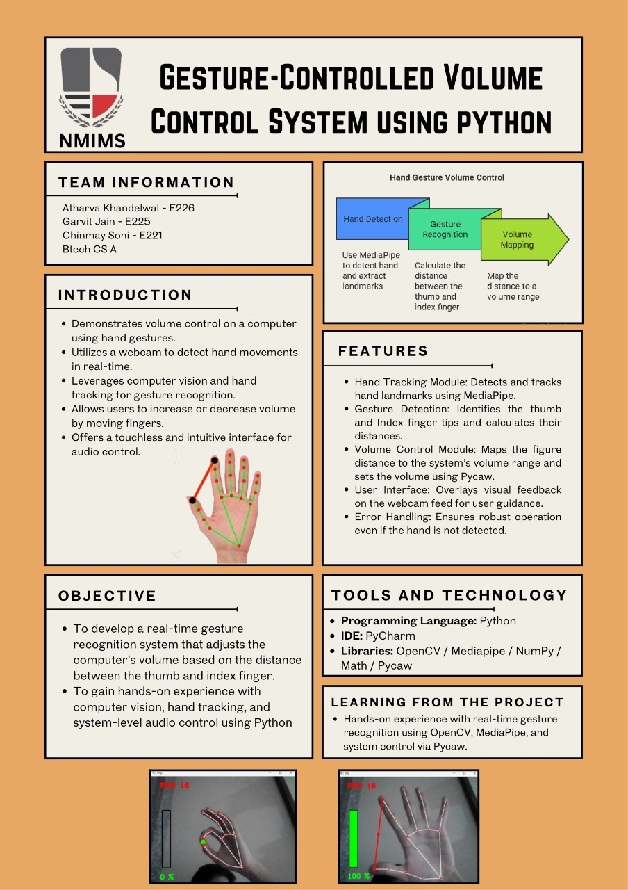

# Python_first_project

A Python project using OpenCV and MediaPipe for real-time hand tracking and gesture-based system volume control.



## Demo

[Add a GIF or video showing it working]

## Overview

This project leverages computer vision to recognize hand gestures from webcam input and control the system volume based on finger positions.

## Technologies Used

- **Python 3.x**
- **OpenCV** - For capturing webcam video and processing images
- **MediaPipe** - For hand landmark detection
- **pycaw** - For controlling system volume on Windows

## Installation

```bash
pip install opencv-python mediapipe pycaw comtypes
```

Or install from requirements.txt:

```bash
pip install -r requirements.txt
```

## How to Run

```bash
python src/Finalproject.py
```

- Show your hand to the webcam
- Pinch gesture (thumb and index finger) controls the volume
- Press `Q` or `Esc` to quit

## Features

- Real-time hand tracking
- Gesture-based volume control
- FPS display
- Visual feedback with landmarks and volume bar
- Detects fingertip positions and distance between fingers

## Future Improvements

- Add more gestures
- Improve accuracy
- Support for multiple platforms (currently Windows-only)
- Add gesture customization options

## File Structure

The project is organized as follows:

- **src/** - Contains all Python source files
  - `1_basicvideocapturing.py` - Basic webcam video capturing
  - `2_basichandrecognition.py` - Basic hand detection using MediaPipe
  - `3_Connecttipsoffinger.py` - Connects tips of fingers
  - `4_addcircletofingertips.py` - Draws circles on fingertip positions
  - `5_showfps.py` - Displays frames per second on video
  - `6_Calculatingthedistancebetweenfingers.py` - Calculates distance between fingertips
  - `7_makingbarwithdistance.py` - Creates a bar to visualize distance/volume
  - `8_connectingwithsystemvolume.py` - Controls system volume via finger distance
  - `Finalproject.py` - **Main project file combining all features**
- **docs/** - Documentation files
- `requirements.txt` - Python package dependencies
- `LICENSE` - MIT License
- `Poster.jpg` - Project poster image

## Prerequisites

- Python 3.7+
- Windows OS (pycaw is Windows-specific)
- Webcam

## How It Works

- The webcam stream is processed in real-time.
- Hand landmarks are detected using MediaPipe.
- The distance between thumb and index fingertip is calculated.
- This distance is mapped to the system volume range using pycaw.
- Visual feedback (landmarks, lines, circles, volume percentage, FPS, and a volume bar) is displayed on the window.

## Acknowledgements

- [MediaPipe](https://google.github.io/mediapipe/)
- [OpenCV](https://opencv.org/)
- [pycaw](https://github.com/AndreMiras/pycaw)

---

> Made by [Chinmay048](https://github.com/Chinmay048)
